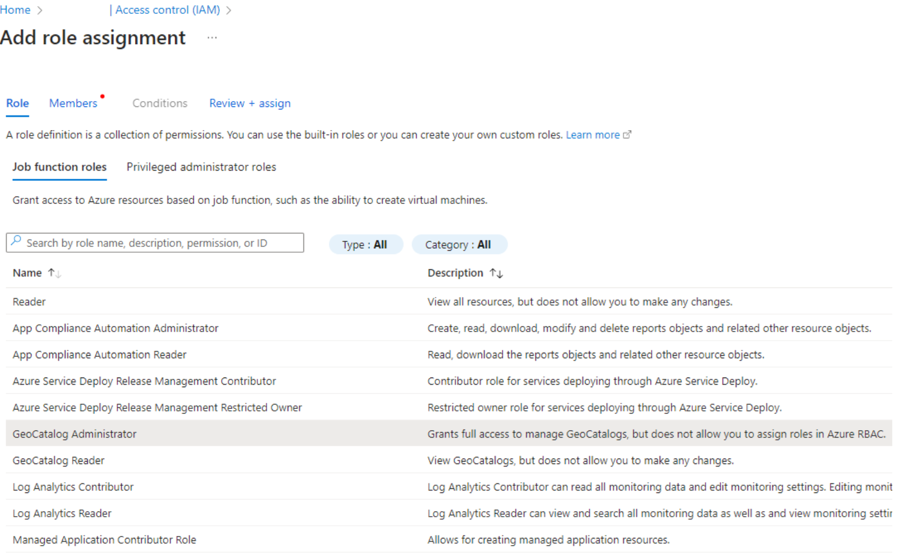
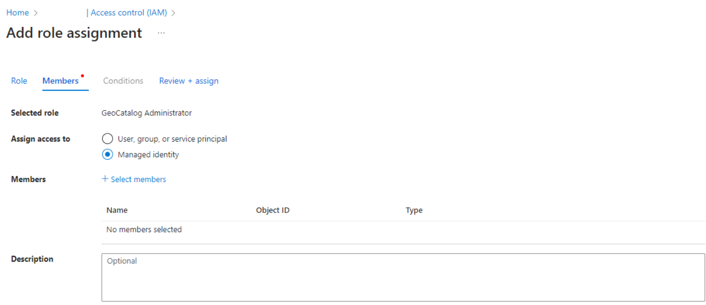
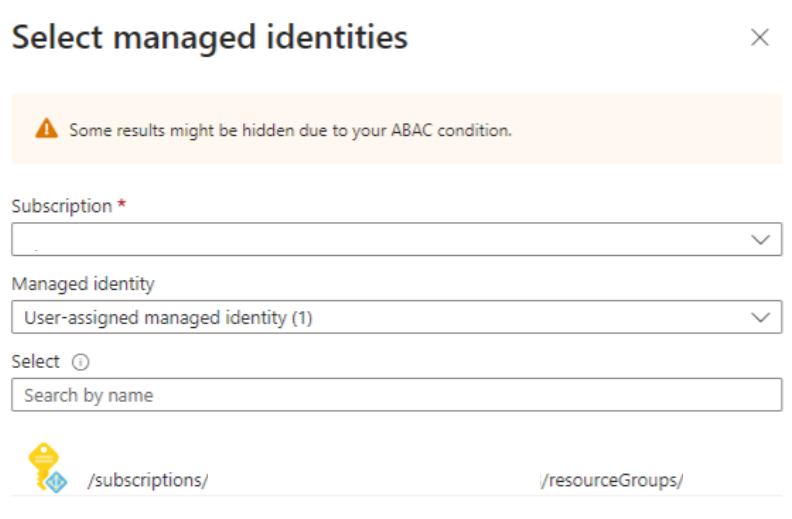

# Configure application authentication for Microsoft Planetary Computer Pro

This article provides step-by-step guidance for developers and administrators to set up secure application authentication and access to Microsoft Planetary Computer Pro. By applying Microsoft Entra ID and managed identities, applications can authenticate seamlessly without managing credentials, ensuring secure interaction with Planetary Computer Pro resources. Whether your application runs on Azure or other environments, this guide outlines the necessary configurations, including role-based access control (RBAC) and token acquisition, to enable secure access.

> [!NOTE]
> For applications that use Azure AD B2C or Microsoft Entra External ID supporting features like social identity providers, the applications need to continue using these identity solutions to proxy authentication traffic since Planetary Computer Pro doesn't support alternatives to Microsoft Entra ID authentication.  

## Prerequisites

- Azure account with an active subscription - [create an account for free](https://azure.microsoft.com/pricing/purchase-options/azure-account?cid=msft_learn)
- An existing [GeoCatalog resource](./deploy-geocatalog-resource.md).


## Applications running on Azure

For applications that are running on Azure, we recommend you create a type of Microsoft Entra identity called user-assigned Managed Identity to access GeoCatalog resource. The applications can use the managed identities to obtain Microsoft Entra tokens (see section [Acquire access token to access Microsoft Planetary Computer Pro](#acquire-access-token-to-access-microsoft-planetary-computer-pro) without having to manage any credentials. For more information of Managed Identities and which type to choose, see [What are managed identities for Azure resources](/entra/identity/managed-identities-azure-resources/overview). To create user-assigned managed identities for your application running on Azure, follow [How to use managed identities for App Service and Azure Functions](/azure/app-service/overview-managed-identity?tabs=portal%2Chttp).

## Applications not running on Azure

For applications that aren't running on Azure, such as on-premises or hosted on other cloud providers, we recommend you [register the application](/entra/identity-platform/quickstart-register-app?tabs=certificate) in Microsoft Entra admin center, including a redirect URI to receive security tokens, to establish a trust relationship between your app and Microsoft identity platform. Registering the app in Microsoft Entra automatically creates a Service Principal for the app, which you can assign RBAC roles later. If your application has a setting to configure Microsoft Entra ID authentication, you can use the registered app's "Application (client) ID" and "Directory (tenant) ID" to do so.

If you can't register the application in Microsoft Entra as recommended previously, you have another option of running the application in an Azure VM or Container app. You can create a user-assigned managed identity and assign it to the Virtual Machine (VM) or Container app as described here - [Configure managed identities on Azure virtual machines (VMs)](/entra/identity/managed-identities-azure-resources/how-to-configure-managed-identities?pivots=qs-configure-portal-windows-vm) and [Managed identities in Azure Container Apps](/azure/container-apps/managed-identity?tabs=portal%2Cdotnet). The application would be able to sign in with the managed identity to access GeoCatalog resource. For example, for the application to run inside a VM using a user-assigned managed identity, you can use:

```console
!az login  --identity --username <client_id|object_id|resource_id> 
```

You can find the client ID, object ID, or resource ID of the managed identity from Azure portal. As an alternative to the CLI, sample Python code is under the section [Acquire access token to access Microsoft Planetary Computer Pro](#acquire-access-token-to-access-microsoft-planetary-computer-pro).

```python
azure.identity.DefaultAzureCredential(managed_identity_client_id=<client_id>)
```

After creating a user-assigned managed identity or a service principal for your application as described previously, you need to decide the type of application access scenario: app-only access, acting only as the application's own identity or delegated access, acting on behalf of a signed-in user.

## App-only access

In this access scenario, the application acts on its own with no user signed in as the default behavior. You can proceed to the section [Microsoft Planetary Computer Pro RBAC configuration for applications](#microsoft-planetary-computer-pro-rbac-configuration-for-applications) to assign the appropriate roles to the application.

## Delegated access

In this access scenario, a user signed into a client application. The client application accesses the resource on behalf of the user. You need to ensure the users of the application are assigned proper RBAC roles as described under the section of [Create and Manage Users](./manage-access.md#create-and-manage-users). You also need to configure the application's API permissions with delegated permissions following these steps:  

1. Sign in to the [Microsoft Entra admin center](https://entra.microsoft.com/)
1. Browse to **Identity** > **Applications** > **App registrations**, and then select your client application
1. Under Manage, select **API permissions**
1. Select **Add a permission**
1. Select the **APIs my organization uses** tab
1. Type **Azure Orbital Planetary Computer** in the search field
1. Select on the matching entry (app ID should be 6388acc4-795e-43a9-a320-33075c1eb83b). It shows up as **Azure Orbital Microsoft Planetary Computer Pro**.
1. Select on **Delegated permissions** box. Check the box next to **user_impersonation**.
1. Select **Add permissions**
1. Select the "Grant admin consent" link (assuming your intent is to grant admin consent in the tenant for this permission)

The delegated authentication pattern is also used when connecting from [QGIS](./configure-qgis.md).

## Microsoft Planetary Computer Pro RBAC configuration for applications

Once you create a Managed identity for an application running on Azure, or a service principal for an application not running on Azure but registered in Microsoft Entra, you need to grant proper permissions to the identities to access the GeoCatalog resource via RBAC configuration.  

Below is a step-by-step example showing how to configure Role-Based Access Control (RBAC) to assign the "GeoCatalog Administrator" role to an application's User-assigned managed identity. You can follow these same steps in the Azure portal to configure RBAC for an application's service principal.

1. On Azure portal go to Microsoft Planetary Computer Pro resource IAM tab on the left.

    [  ](media/role-based-access-control-identity-access-management-blade.png#lightbox)

1. Select on **Add role Assignment** and then select **GeoCatalog Administrator** under "Job function roles"

    [  ](media/role-based-access-control-role-assignment.png#lightbox)

1. Select the **Next** button and then select radio button of **Managed identity**

    [  ](media/role-based-access-control-managed-id.png#lightbox)

1. Select on **Select members** and select the subscription and the User-assigned managed identity on the **Select managed identities** pane on the right-hand side.

    [  ](media/role-based-access-control-selected-members.png#lightbox)

1. Select on **Next** to verify the information and finish **review + assign**.

## Acquire access token to access Microsoft Planetary Computer Pro

After you configure RBAC to grant your application proper permissions, the application needs to acquire an access token to authenticate requests. Python sample code below: 

```python
import azure.identity
credential = azure.identity.DefaultAzureCredential()
token = credential.get_token("https://geocatalog.spatio.azure.com/")
headers = {"Authorization": f"Bearer {token.token}"} 
```

> [!NOTE]
> If your application has multiple managed identities assigned to it, you need to explicitly pass the right one: `azure.identity.DefaultAzureCredential(managed_identity_client_id=<client_id>)`. Alternatively, you can configure environment variables of your application on Azure portal to add `"AZURE_CLIENT_ID"` with the right managed identity client ID.

> [!NOTE]
> You can add `.default` or `user_impersonation` as scope to `credential.get_token()` based on your expected user authentication behavior.

> [!NOTE]
> If your application is a web app, anytime you make a change to your code or app configuration, make sure to close and reopen web browser to avoid cached credentials being used.

See [Access tokens in the Microsoft identity platform](/entra/identity-platform/access-tokens) for more information of access tokens. When you acquire access tokens via calling DefaultAzureCredentials(), the acquired tokens are [cached](https://aka.ms/azsdk/net/identity/token-cache) by the credential instance. Token lifetime and refreshing is handled automatically. You can pass DefaultAzureCredential instance around and invoke `GetToken()` or `GetTokenAsync()` right before you need a token so that you always get a token that isn't expired. If you need to maintain a long open session, you can handle token expiration in an error handler to catch the exception and acquire a new token.  

If you can't use `DefaultAzureCredentials()` and instead use other methods such as `AzureCliCredential()` to acquire access tokens, you need to manage the token's lifetime and refresh. See [Configurable token lifetimes in the Microsoft identity platform](/entra/identity-platform/configurable-token-lifetimes) and [Refresh tokens in the Microsoft identity platform](/entra/identity-platform/refresh-tokens) for more information.

## Next steps

> [!div class="nextstepaction"]
> [Build Applications with Microsoft Planetary Computer Pro](./use-explorer.md)

## Related content

- [Manage access for Microsoft Planetary Computer Pro](./manage-access.md)