# Configure QGIS to access a GeoCatalog resource

This guide explains how to configure the open-source [QGIS](https://qgis.org/) desktop GIS software to access geospatial datasets from the Microsoft Planetary Computer Pro GeoCatalog using Microsoft Entra ID authentication.

QGIS enables direct interaction with STAC collections in Microsoft Planetary Computer Pro. With QGIS, you can visualize, analyze, and style data on the fly, and integrate it with local layers from Azure.

All GeoCatalog assets can be downloaded to your desktop. Assets in Cloud Optimized GeoTIFF (COG) or Cloud Optimized Point Cloud (COPC) format stream directly.

Configuration consists of two parts:
- [Microsoft Entra app registration](#register-the-microsoft-entra-application-for-qgis)
- [STAC connection inside QGIS](#create-the-stac-connection)

Registering the Microsoft Entra application is a one-time task for your tenant. After registration, users enter the Application (client) ID and Directory (tenant) ID in QGIS to set up the STAC connection.

## Prerequisites

### Microsoft Entra App registrations
- Access to a Microsoft Entra ID tenant
- Azure subscription where your identity has one of these roles: Application Developer, Cloud Application Administrator, or Application Administrator.

### QGIS STAC connection
- Download and install [QGIS Developer](https://qgis.org/download/) (`qgis-dev`) on your desktop machine 
	> [!NOTE] 
	> This feature is available only in the QGIS nightly builds until the release of QGIS 4.0
- GeoCatalog Reader or GeoCatalog Administrator [role-based access controls](./manage-access.md).
- Microsoft Planetary Computer Pro GeoCatalog deployment that contains at least one collection.

## Register the Microsoft Entra application for QGIS

> [!TIP]
> Review [Register an application in Microsoft Entra ID](/entra/identity-platform/quickstart-register-app) for background information on app registration.

Register QGIS as an application in Microsoft Entra ID and grant it delegated permissions so it can act on behalf of the signed-in user.

In the Azure portal, go to Microsoft Entra ID > App registrations > New registration:

[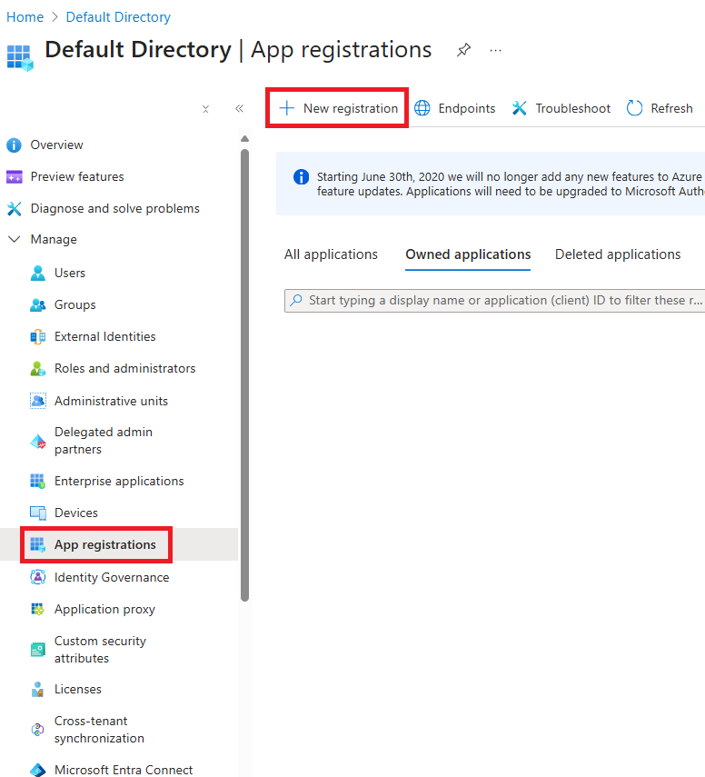](./media/app-registration.png#lightbox)

### Register the application
1. Enter a descriptive name for the application.  
2. For supported account types, select the tenant option your organization uses (single tenant or multitenant only).  
3. Under Redirect URI, choose Public client/native (mobile & desktop) and set the URI to `http://localhost:7070`.  
4. Select Register.  

### Configure API permissions

Configure delegated API permissions:

1. In the app registration, select **API permissions** > **Add a permission**.

	[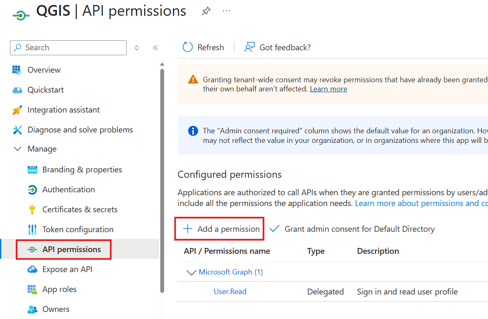](./media/qgis-api-permissions.png#lightbox)

2. Select **APIs my organization uses**, search for `Azure Orbital Spatio`, and pick the service to open the permission dialog.

	[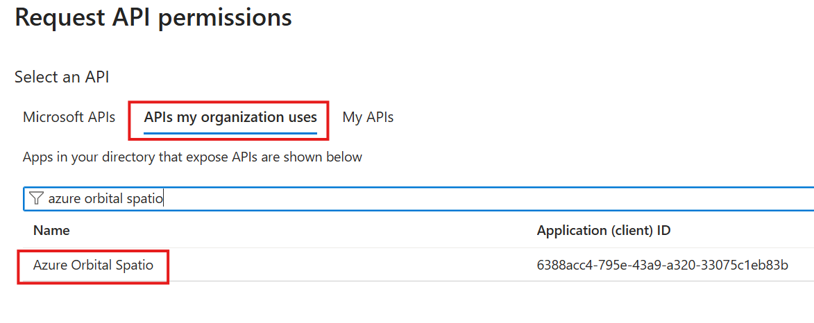](./media/add-azure-orbital-spatio.png#lightbox)

3. In **Request API permissions**, select **Delegated permissions**, check **user_impersonation**, and then select **Add permissions** to grant the scope.

	[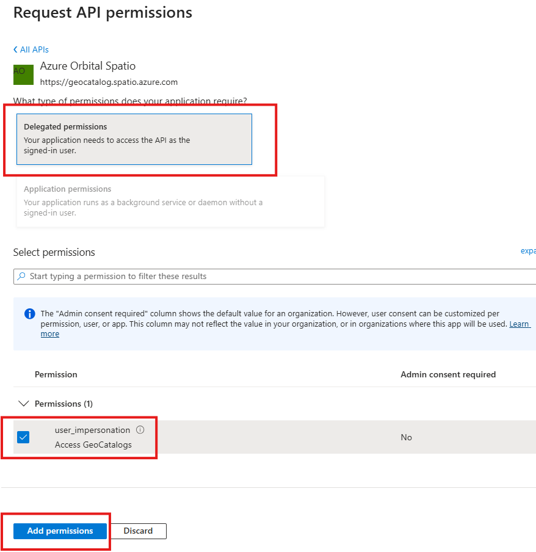](./media/configure-api-permissions.png#lightbox)

### Reviewing the Application and Directory IDs

Return to **Overview** and record the **Application (client) ID** and **Directory (tenant) ID**. You need to enter them in QGIS later to configure the STAC connection.

[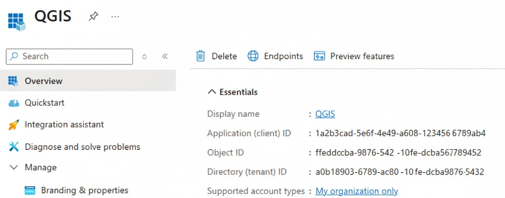](./media/qgis-client-id.png#lightbox)

## Configure QGIS for GeoCatalog access

A STAC catalog in QGIS is a browsable data source. It exposes hierarchical STAC metadata (catalog → collection → item → asset) instead of a single static file. When you expand nodes, QGIS issues live API requests to the GeoCatalog STAC endpoint so you always see the latest collections and items in your GeoCatalog. 

### Create the STAC connection

Create the STAC connection inside QGIS by following these steps:

1. In the **Browser** panel, expand **STAC** to view the connection menu.
2. Right-click **STAC** and select **New STAC Connection** to open the configuration dialog.
	[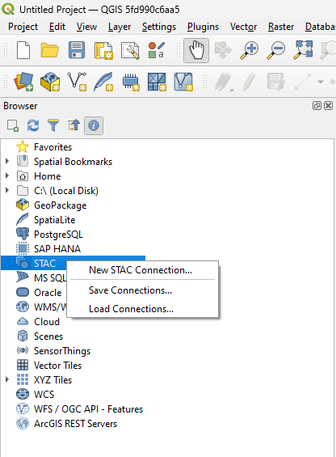](./media/qgis-add-stac-catalog.png#lightbox)

### Configure STAC connection authentication

1. In the "Name" field, name this connection.
2. Enter the URL of your GeoCatalog and add the STAC API path by appending `/stac` to the URL. 
3. Select the **plus (+)** button to configure the authentication.
[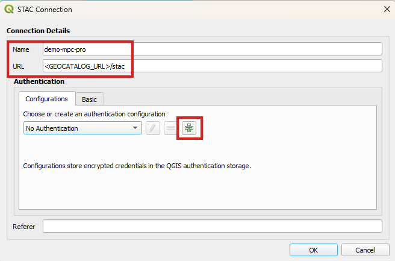](./media/qgis-stac-connection-configuration.png#lightbox)

### STAC connection authentication configuration

1. From Authentication, select **Microsoft Planetary Computer**. 
[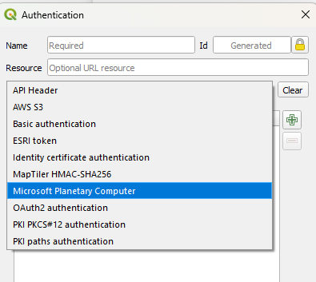](./media/select-microsoft-planetary-computer.png#lightbox)

2. Select **Planetary Computer Pro** from the "Server type" drop-down. 
[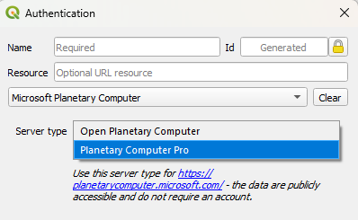](./media/select-microsoft-planetary-computer-pro.png#lightbox)

3. Enter the following information into the text boxes:

	- A name for the authentication settings
    - GeoCatalog URL
    - [Application and Directory ID](#reviewing-the-application-and-directory-ids)

[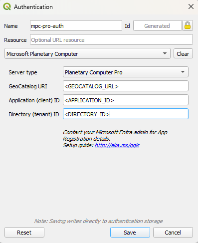](./media/authorization-configuration.png#lightbox)

Once these settings are complete, your GeoCatalog is configured for access through the QGIS STAC connection. 

## Using the QGIS STAC connection

To browse the collections, select your GeoCatalog in the data layer browser, and expand it. 

Once you expand, QGIS will redirect you to a web browser to authenticate with Microsoft Entra. Complete the authentication process for your organization to continue. 

[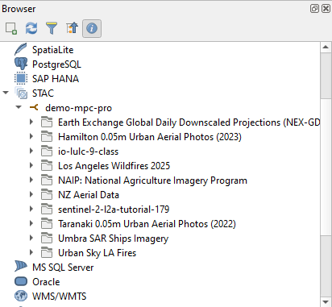](./media/stac-catalog-in-qgis.png#lightbox)

> [!TIP]
> If your GeoCatalog has zero STAC Collections, you see a `Host requires authentication` error. To resolve this error, create a [STAC Collection](./create-collection-web-interface.md). 

Continue to expand the collections until you locate a STAC Item. To visualize this item, select the item and drag it to the map view. If the data is a Cloud Optimized GeoTIFF (COG) or Cloud Optimized Point Cloud (COPC), it automatically imports and projects onto the map. 

[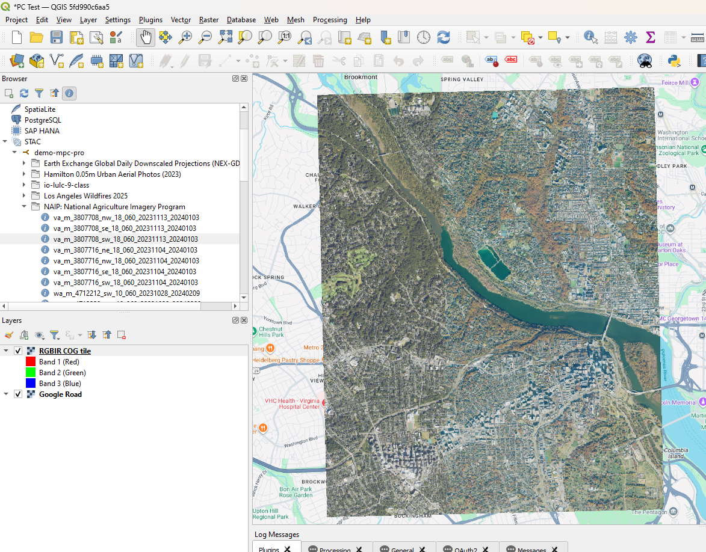](./media/add-data-to-map.png#lightbox)

### STAC search and filtering

If you want to search for data or run a STAC filter in your catalog, the STAC API is exposed through the Layer manager. 

1. On the **Layer** menu, select **Add Layer** > **Add Layer from STAC Catalog**.

1. Select your STAC connection to the GeoCatalog, and then select **Connect**. 

1. Choose the index you want to filter on. You can filter on spatial, temporal, or collection extent. 
[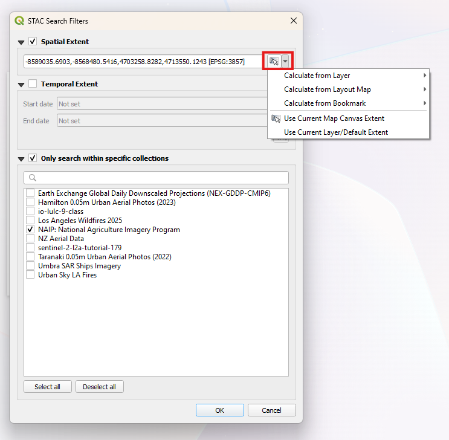](./media/filter-spatial-extent.png#lightbox)

1. Select the item to add it to the map extent or download the assets directly to your local machine. If you hover over the item, the spatial extent previews on the map canvas in red. 
[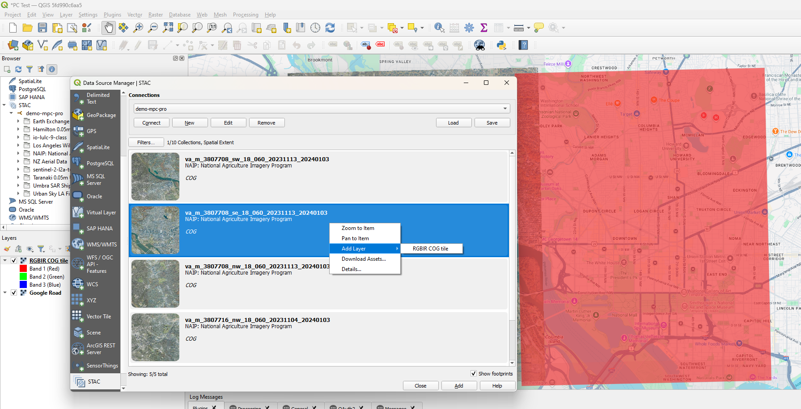](./media/add-cog-to-map.png#lightbox)

## Related content

- [Configure the Planetary Computer collection web interface](./configure-collection-web-interface.md)
- [Create a connection from ArcGIS Pro to the STAC API](./create-connection-arc-gis-pro.md)
- [Use the Planetary Computer Explorer](./use-explorer.md)
- [Manage access to Planetary Computer resources](./manage-access.md)
- [Visualize assets in Planetary Computer](./visualize-assets.md)